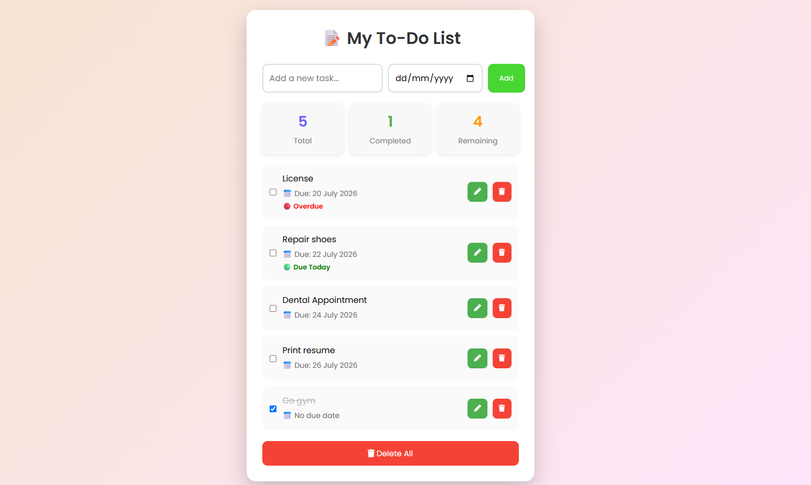

# 📝 My To-Do List

A modern and responsive To-Do List web application built with **HTML, CSS, and JavaScript**. This project helps users manage their daily tasks by allowing them to add, edit, complete, delete, and organize tasks with due dates. All tasks are automatically saved using Local Storage, so they remain available even after refreshing the browser.

---

## 📸 Screenshot


---

## ✨ Features

- ✅ Add new tasks
- ✏️ Edit existing tasks
- 🗑️ Delete individual tasks
- 🗑️ Delete all tasks
- ☑️ Mark tasks as completed
- 💾 Save tasks using Local Storage
- 📊 Live task counters (Total, Completed, Remaining)
- 📅 Add due dates to tasks
- 🔴 Automatically detect overdue tasks
- 🟢 Highlight tasks due today
- 📅 Automatically sort tasks by due date
- 📱 Responsive design for desktop and mobile devices

---

## 🛠️ Built With

- HTML5
- CSS3
- JavaScript (ES6)
- Font Awesome

---

## 📚 What I Learned

Building this project helped me improve my understanding of:

- DOM Manipulation
- JavaScript Functions
- Event Listeners
- Arrays and Objects
- Local Storage
- Dynamic HTML Rendering
- Template Literals
- Array Methods (`push()`, `splice()`, `filter()`, `sort()`, `forEach()`)
- Date Handling in JavaScript
- Writing cleaner, modular code using helper functions

---

## 🚀 Future Improvements

Some features I plan to add in future versions include:

- 🌙 Dark Mode
- 🔍 Search Tasks
- ⭐ Task Priority Levels
- 🏷️ Categories
- 📅 Calendar View
- 🔔 Task Reminders
- ✨ Animations and smoother transitions

---

## ▶️ Getting Started

1. Clone the repository.

```bash
git clone https://github.com/YOUR_USERNAME/todo-app.git
```

2. Open the project folder.

3. Open `index.html` in your web browser.

No installation or additional packages are required.

---

## 👩‍💻 Author

**Thea Arabella Mangogtong**

Aspiring Frontend Developer passionate about creating clean, responsive, and user-friendly web applications.

GitHub:
https://github.com/itsyoghorlela
